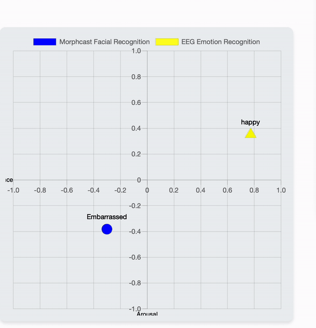
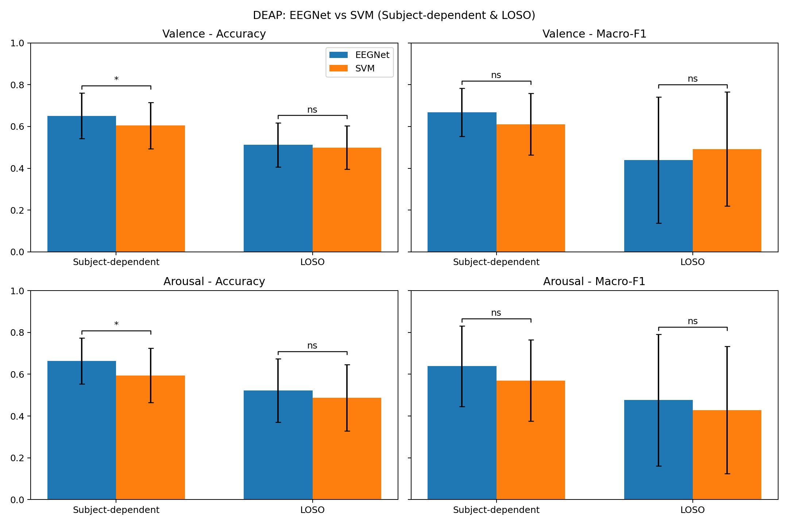

# EEG Emotion Recognition Experiments

This repository contains EEG-based emotion recognition experiments built around
EEGNet-style neural networks and classical SVM baselines. The current workspace
covers two public EEG emotion datasets:

- DEAP: binary valence/arousal classification, LOSO evaluation,
  subject-dependent evaluation, model comparison, and a real-time regression
  prototype.
- SEED-IV: four-class emotion classification across cross-session,
  subject-dependent, and LOSO evaluation settings.

The project is research-oriented: scripts are kept close to the experiments
that produced the saved summaries and figures, so results can be inspected,
replotted, or rerun with adjusted dataset paths.

## Repository Layout

```text
.
|-- EEGnet - DEAP/
|   |-- deap_experiment_utils.py
|   |-- prepare_data.py
|   |-- train_subject_dependent_eegnet_deap.py
|   |-- train_loso_eegnet_deap.py
|   |-- train_subject_dependent_shallownet_deap.py
|   |-- svm_subject_dependent_deap.py
|   |-- svm_loso_deap.py
|   |-- train_eegnet_regression_realtime_deap.py
|   |-- realtime_eegnet_circumplex_ws_deap.py
|   `-- realtime_inference_gui.py
|-- EEGnet - SEED IV/
|   |-- load_data.py
|   |-- train_model_seediv_all_cross_session.py
|   |-- train_subject_dependent_seediv.py
|   |-- train_loso_eegnet_seediv.py
|   |-- svm_*_seediv.py
|   |-- analysis_figures/
|   |-- comparison_figures/
|   |-- loso_analysis/
|   `-- subject_dependent_analysis/
|-- deap_* / realtime_*
|   `-- saved DEAP summaries, histories, and generated figures
|-- assets/
|   `-- README media, including the cropped MorphCast/EEG demo GIF
|-- MorphCastProject_Suda/
|   `-- optional browser demo assets
|-- EMO RECOGNITION/
|   `-- legacy scripts from the earlier repository state
`-- archive/
    `-- local raw dataset archive; ignored by git
```

## Data

Raw EEG data is intentionally not tracked in git. The local workspace contains
large DEAP/SEED-IV archives, including `.mat` files over 100 MB each, so
`archive/`, cached `.npz` files, and common raw EEG data extensions are ignored.

Expected data layout:

- DEAP scripts currently default to:
  `C:/Users/xinji/Desktop/data_preprocessed_python`
- SEED-IV scripts expect feature files arranged by session:
  `archive/seed_iv/eeg_feature_smooth/1`,
  `archive/seed_iv/eeg_feature_smooth/2`,
  `archive/seed_iv/eeg_feature_smooth/3`

If you run the code on a different machine, update the path constants in the
training scripts or pass the available command-line flags where supported.

## Setup

```powershell
python -m venv .venv
.\.venv\Scripts\Activate.ps1
pip install -r requirements.txt
```

Install PyTorch with the build that matches your CUDA/CPU environment if the
generic `pip install -r requirements.txt` command does not select the right
wheel for your machine.

## Running DEAP Experiments

```powershell
cd "EEGnet - DEAP"

# EEGNet experiments
python train_subject_dependent_eegnet_deap.py
python train_loso_eegnet_deap.py

# Baselines and comparison
python train_subject_dependent_shallownet_deap.py
python svm_subject_dependent_deap.py
python svm_loso_deap.py
python stats_significance_deap.py
python plot_model_comparison_deap.py
```

For the real-time DEAP regression prototype:

```powershell
cd "EEGnet - DEAP"
python train_eegnet_regression_realtime_deap.py
python dummy_lsl_eeg_stream_deap.py
python realtime_eegnet_circumplex_ws_deap.py
```

## MorphCast and EEG Demo

The browser demo overlays two live points on the same valence-arousal map:
MorphCast facial affect from the webcam and EEGNet regression output from an
LSL EEG stream. The GIF below was cropped from the local `Demo.mov` recording
so that only the 2D map is shown.



The web interface lives in `MorphCastProject_Suda/index.html`, and the main
logic is in `MorphCastProject_Suda/script.js`. The JavaScript file creates the
Chart.js scatter plot, starts the MorphCast SDK modules, listens for
MorphCast arousal/valence events, and connects to `ws://localhost:8767`.
When EEG or MorphCast messages arrive, `updateChart(...)` moves the
corresponding point on the 2D map.

To open only the browser interface:

```powershell
cd MorphCastProject_Suda
python -m http.server 8000
```

Then open `http://localhost:8000/index.html` and allow camera access when the
MorphCast popup appears.

To run the linked MorphCast + EEG demo, start the compare WebSocket server,
the browser UI, an EEG stream, and the real-time EEGNet client:

```powershell
# Terminal 1: compare server for both data sources
cd "EEGnet - DEAP"
python websocket_server_compare_deap.py

# Terminal 2: web UI
cd MorphCastProject_Suda
python -m http.server 8000

# Terminal 3: optional dummy EEG stream for demonstration
cd "EEGnet - DEAP"
python dummy_lsl_eeg_stream_deap.py --stream-name DummyEEG --n-channels 32 --fs 100

# Terminal 4: EEGNet client that sends EEG points to the same websocket
cd "EEGnet - DEAP"
python realtime_eegnet_circumplex_ws_deap.py `
  --model-path ..\realtime_eegnet_regression_deap\eegnet_regressor_best.pt `
  --scaler-path ..\realtime_eegnet_regression_deap\eegnet_regressor_scaler.npz `
  --stream-name DummyEEG `
  --fs 100 `
  --ws-uri ws://localhost:8767 `
  --step-sec 0.20 `
  --demo-gain 2.8 `
  --center-sec 50 `
  --norm-sec 50 `
  --demo-smooth-alpha 0.06
```

The repository does not track local `.pt` checkpoints or `.npz` scaler/cache
files by default. Run `train_eegnet_regression_realtime_deap.py` first, or
point `--model-path` and `--scaler-path` to your own locally generated files.
On Windows, `EEGnet - DEAP/run_demo_demo.cmd` and
`EEGnet - DEAP/run_demo_real.cmd` start the same four services, but the
`PYTHON_EXE` setting may need to be changed for your environment.

## Running SEED-IV Experiments

```powershell
cd "EEGnet - SEED IV"

# EEGNet-style models
python train_model_seediv_all_cross_session.py
python train_subject_dependent_seediv.py
python train_loso_eegnet_seediv.py

# SVM baselines and comparison
python svm_cross_session_seediv.py
python svm_subject_dependent_seediv.py
python svm_loso_seediv.py
python stats_significance.py
python plot_model_comparison.py
```

## Current Results

### DEAP

| Paradigm | Model | Valence Acc | Valence F1 | Arousal Acc | Arousal F1 |
| --- | --- | ---: | ---: | ---: | ---: |
| Subject-dependent | EEGNet | 0.6488 | 0.6634 | 0.6593 | 0.6281 |
| Subject-dependent | ShallowNet | 0.5803 | 0.6013 | 0.6283 | 0.6011 |
| Subject-dependent | SVM | 0.6043 | 0.6109 | 0.5940 | 0.5696 |
| LOSO | EEGNet | 0.5123 | 0.4391 | 0.5219 | 0.4760 |
| LOSO | SVM | 0.4989 | 0.4918 | 0.4871 | 0.4284 |

Paired tests in `deap_model_comparison/significance_results.txt` show that the
subject-dependent EEGNet model improves over SVM for valence accuracy and
arousal accuracy after Holm correction, while LOSO differences are weaker.



### SEED-IV

| Paradigm | Model | Accuracy | Macro-F1 |
| --- | --- | ---: | ---: |
| Cross-session | EEGNet | 0.4417 | 0.3643 |
| Cross-session | SVM | 0.3972 | 0.3088 |
| Cross-session | Topomap CNN | 0.4306 | 0.3390 |
| Cross-session | GCN | 0.3806 | 0.2960 |
| Subject-dependent | EEGNet | 0.6533 | 0.6304 |
| LOSO | EEGNet | 0.3917 | 0.3514 |


## Notes

- The code uses PyTorch for EEGNet/ShallowNet experiments and scikit-learn for
  SVM baselines.
- Several scripts still contain local absolute paths from the original
  experiments. Treat those paths as configuration values when reproducing.
- Generated caches, raw datasets, Python bytecode, IDE files, and trained
  checkpoints are excluded from new commits by `.gitignore`.
- Existing legacy files in `EMO RECOGNITION/` are preserved from the previous
  remote repository state.
